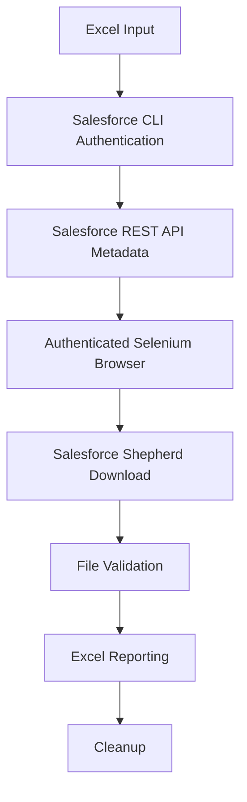

## Architecture

The downloader uses a hybrid control and data flow. Salesforce REST APIs retrieve structured metadata, while Salesforce Shepherd endpoints deliver binaries through an authenticated browser session.

### High-Level Workflow

### Detailed Architecture Diagram

The following diagram provides a more detailed visual representation of the components and their interactions.

  

## Component Responsibilities

- **Salesforce CLI** supplies the instance URL, access token, API version, and org alias through `org_info.json`.
- **Salesforce REST API** executes paginated SOQL queries for `ContentDocument` and `ContentDocumentLink` metadata.
- **Selenium and Chrome** establish the Salesforce session through `frontdoor.jsp` and initiate Shepherd downloads.
- **Robot Framework** coordinates input, metadata, downloads, validation, reporting, and teardown.
- **Python libraries** support Chrome configuration, Excel operations, filesystem work, and validation used by Robot keywords.
- **Pabot** can split batch tests across processes. UUID-based download and artifact directories separate their output.

After a download appears, the workflow rejects temporary file suffixes, waits for completion and stable size, compares the binary with Salesforce `ContentSize`, moves it to a `ContentDocumentId` directory, and verifies the destination.

## Why Browser-Based Download Is Used

Metadata retrieval is API-driven because REST and SOQL provide structured records and relationships efficiently. Binary transfer uses Salesforce's authenticated browser flow through Shepherd. Selenium establishes and maintains the browser session required for that flow.

This avoids routing large volumes of binary download traffic through REST API requests while preserving Salesforce session behavior. It still consumes API calls for metadata, requires Chrome resources, and remains subject to session expiration, permissions, network conditions, and Salesforce response behavior.

## Why Robot Framework?

Robot Framework provides keyword-driven orchestration for a workflow that combines authentication, metadata retrieval, browser downloads, validation, reporting, and cleanup. Its resource files keep these steps reusable across batch tests while allowing implementation-heavy operations to remain in Python libraries. Pabot extends the same test structure to process-level parallel execution without requiring a separate orchestration layer. This separation keeps operational flow readable and makes individual responsibilities easier to update and diagnose.

## Design Principles

- **Deterministic processing:** input IDs are normalized, validated, and deduplicated.
- **One physical download per ContentDocument:** repeated IDs within a batch do not trigger repeated transfers.
- **Preservation of multiple ContentDocumentLink records:** all retrieved links can be retained for migration mapping.
- **Validation before success reporting:** completion, stability, expected size, movement, and destination checks precede success.
- **Failure isolation:** failed IDs are separated from successful outputs.
- **Parallel worker separation:** each test uses unique download and artifact directories.
- **Recoverable reporting:** failure workbooks provide input for controlled reruns.
- **Minimal exposure of sensitive authentication data:** token-bearing operations suppress ordinary logs and authentication files remain uncommitted.

## Runtime Locations

| Location                  | Responsibility                                            |
|---------------------------|-----------------------------------------------------------|
| `src/robot/orchestrator/` | Batch definitions and suite execution                     |
| `src/robot/resources/`    | Workflow, API, download, Excel, CLI, and cleanup keywords |
| `src/robot/libraries/`    | Custom Python libraries                                   |
| `input/`                  | Source workbooks containing IDs                           |
| `downloads/`              | Validated binaries, isolated by test and UUID             |
| `artifacts/`              | Import and failed-ID workbooks                            |
| `results/`                | Robot Framework and Pabot reports                         |

---

[← Previous](Examples.md) | [Next →](Performance.md)

[Back to README](../README.md)
