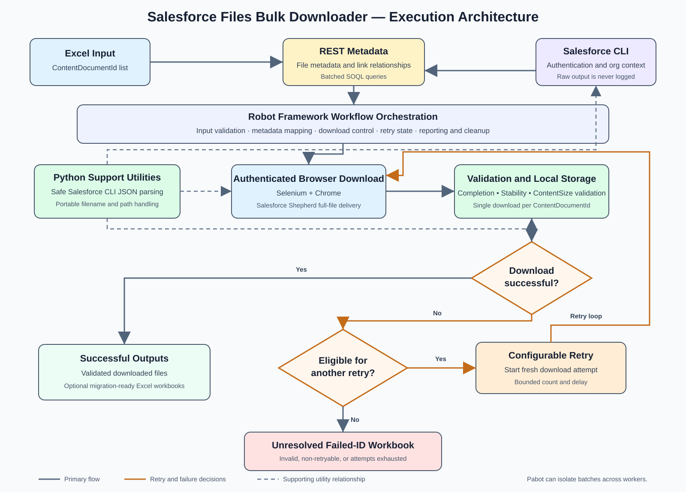

# Architecture

The downloader uses a hybrid control and data flow. Salesforce REST APIs retrieve structured metadata, while Salesforce Shepherd endpoints deliver binaries through an authenticated browser session.

## Architecture diagram

The diagram shows the main components and the flow from input validation through metadata retrieval, file download, migration workbook generation, and failure reporting.

  

The editable source for the detailed diagram is [`architecture.svg`](architecture.svg).

## Component responsibilities

- **Salesforce CLI** generates the authentication file before execution and retrieves daily API limits. Suite setup reads the alias, org ID, and API version from that file without invoking concurrent org-display commands.
- **Salesforce REST API** executes paginated SOQL queries for `ContentDocument` and `ContentDocumentLink` metadata.
- **Selenium and Chrome** establish the Salesforce session through `frontdoor.jsp` and initiate Shepherd downloads.
- **Robot Framework** coordinates suite initialization, strict configuration validation, per-batch API preflight, input normalization, metadata mapping, downloads, retry state, reporting, and teardown.
- **Python libraries** provide safe Salesforce CLI JSON parsing, 15-to-18-character ID canonicalization, destination-aware filename handling, Chrome configuration, transactional Excel updates, and filesystem support used by Robot keywords.
- **Pabot** can split batch tests across processes. UUID-based download and artifact directories separate their output.

Before any Salesforce work begins, workbook-generation flags are trimmed, normalized, and validated as `Yes` or `No`. Input IDs are then canonicalized and deduplicated. Metadata queries follow Salesforce pagination, while the preflight deliberately reports a minimum request estimate because the number of additional pages cannot be known from the input count alone.

After a download appears, the workflow rejects temporary file suffixes, waits for completion and stable size, compares the binary with Salesforce `ContentSize`, moves it to a `ContentDocumentId` directory, and verifies the destination. Migration rows are staged and committed together. The document is recorded as successful only after that transaction completes; if it fails, the moved binary and per-ID directory are cleaned up before the ID is reported as failed.

## Why browser-based download is used

Metadata retrieval is API-driven because REST and SOQL provide structured records and relationships efficiently. Binary transfer uses Salesforce's authenticated browser flow through Shepherd. Selenium establishes and maintains the browser session required for that flow.

This avoids routing large volumes of binary download traffic through REST API requests while preserving Salesforce session behavior. It still consumes API calls for metadata, requires Chrome resources, and remains subject to session expiration, permissions, network conditions, and Salesforce response behavior.

## Why Robot Framework?

Robot Framework provides keyword-driven orchestration for a workflow that combines authentication, metadata retrieval, browser downloads, validation, reporting, and cleanup. Its resource files keep these steps reusable across batch tests while allowing implementation-heavy operations to remain in Python libraries. Pabot extends the same test structure to process-level parallel execution without requiring a separate orchestration layer. This separation keeps operational flow readable and makes individual responsibilities easier to update and diagnose.

## Design principles

- **Deterministic processing:** valid 15-character IDs are canonicalized to 18 characters before validation and deduplication.
- **One physical download per ContentDocument:** repeated IDs within a batch do not trigger repeated transfers.
- **Preservation of multiple ContentDocumentLink records:** all retrieved links can be retained for migration mapping.
- **Validation before success reporting:** completion, stability, expected size, movement, destination checks, and workbook commit all precede success.
- **Failure isolation:** failed IDs are separated from successful outputs.
- **Bounded recovery:** eligible download failures receive a configurable number of full-download retries before they are reported.
- **Parallel worker separation:** each test uses unique download and artifact directories.
- **Recoverable reporting:** only unresolved IDs are written to failure workbooks for controlled reruns.
- **Minimal exposure of sensitive authentication data:** token-bearing operations suppress ordinary logs and authentication files remain uncommitted.
- **Capacity protection:** each batch uses a conservative minimum estimate and preserves a configurable daily API reserve before creating artifacts. Pagination and concurrent workers are handled operationally through the safety buffer; workers do not share a reservation counter.

## Runtime locations

| Location                  | Responsibility                                            |
|---------------------------|-----------------------------------------------------------|
| `src/robot/orchestrator/` | Batch definitions and suite execution                     |
| `src/robot/resources/`    | Workflow, API, download, Excel, CLI, and cleanup keywords |
| `src/robot/libraries/`    | Custom Python libraries                                   |
| `input/`                  | Source workbooks containing IDs                           |
| `downloads/`              | Validated binaries, isolated by test and UUID             |
| `artifacts/`              | Import and failed-ID workbooks                            |
| `results/`                | Robot Framework and Pabot reports                         |

---

[← Previous](Examples.md) | [Next →](Performance.md)

[Back to README](../README.md)
