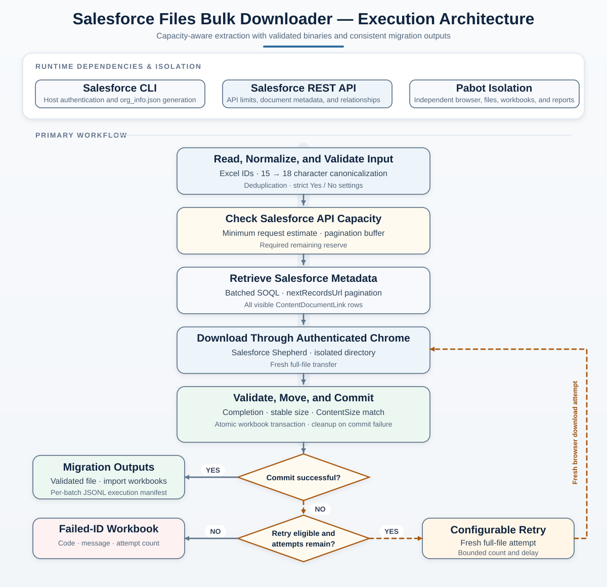

# Architecture

The downloader gets metadata from Salesforce REST APIs and binaries from Salesforce Shepherd through an authenticated browser session.

## Architecture diagram

The diagram traces one batch through validation, metadata queries, downloads, workbook updates, and failure reporting.

  

The editable source for the detailed diagram is [`architecture.svg`](architecture.svg).

## Component responsibilities

- **Salesforce CLI** authenticates the source org and creates the protected authentication file used by each worker.
- **Salesforce REST API** executes paginated SOQL queries for `ContentDocument` and `ContentDocumentLink` metadata.
- **Selenium and Chrome** establish the Salesforce session through `frontdoor.jsp` and initiate Shepherd downloads.
- **Robot Framework** coordinates configuration, batch setup, API preflight, metadata, downloads, retries, reporting, and cleanup.
- **Python libraries** provide safe Salesforce CLI JSON parsing, 15-to-18-character ID canonicalization, destination-aware filename handling, Chrome configuration, transactional Excel updates, and filesystem support used by Robot keywords.
- **Pabot** can split batch tests across processes. UUID-based download and artifact directories separate their output.

Before contacting Salesforce, the downloader validates the workbook options, canonicalizes the input IDs, and removes duplicates. Metadata queries follow every page returned by Salesforce, which is why the capacity preflight can provide only a minimum request estimate.

When a download appears, the workflow rejects temporary file suffixes, waits for completion and a stable size, compares the file with Salesforce `ContentSize`, moves it to its `ContentDocumentId` directory, and verifies the destination. It stages and commits migration rows as one transaction. The document succeeds only after that commit. If the commit fails, the downloader removes the moved binary and per-ID directory before reporting the failure.

## Why browser-based download is used

REST and SOQL provide the structured records and relationships needed for metadata processing. Binary transfer uses Salesforce's authenticated Shepherd flow, with Selenium maintaining the required browser session.

This keeps high-volume binary traffic out of REST requests while preserving Salesforce's browser-session behavior. Metadata still consumes API calls, and downloads remain subject to permissions, session expiry, network conditions, and available Chrome resources.

## Why Robot Framework?

Robot Framework offers a readable way to coordinate the workflow and report what happened. Resource files share that logic across batches, Python libraries handle lower-level operations, and Pabot runs the same batch tests in separate processes.

## Design principles

- **Deterministic processing:** valid 15-character IDs are canonicalized to 18 characters before validation and deduplication.
- **One physical download per ContentDocument:** repeated IDs within a batch do not trigger repeated transfers.
- **Preservation of multiple ContentDocumentLink records:** all retrieved links can be retained for migration mapping.
- **Validation before success reporting:** completion, stability, expected size, movement, destination checks, and workbook commit all precede success.
- **Structured failure isolation:** failed IDs are separated from successful outputs with stable failure codes, sanitized messages, and attempt counts.
- **Bounded recovery:** eligible download failures receive a configurable number of full-download retries before they are reported.
- **Parallel worker separation:** each test uses unique download and artifact directories.
- **Recoverable reporting:** only unresolved IDs are written to failure workbooks for controlled reruns.
- **Machine-readable reconciliation:** each batch writes an append-only JSONL event manifest; success events follow binary validation and workbook commit.
- **Authentication detection:** REST `401`/`INVALID_SESSION_ID`, browser login redirects, and downloaded Salesforce HTML login responses are classified as expired sessions.
- **Minimal exposure of sensitive authentication data:** token-bearing operations suppress ordinary logs and authentication files remain uncommitted.
- **Capacity protection:** after starting its audit manifest, each batch uses a conservative minimum estimate and preserves a configurable daily API reserve before creating migration workbooks or download directories. Pagination and concurrent workers are handled operationally through the safety buffer; workers do not share a reservation counter.

## Runtime locations

| Location                  | Responsibility                                            |
|---------------------------|-----------------------------------------------------------|
| `src/robot/orchestrators/` | Batch definitions and suite execution                     |
| `src/robot/resources/`    | Workflow, API, download, Excel, and cleanup keywords      |
| `src/robot/libraries/`    | Custom Python libraries                                   |
| `input/`                  | Source workbooks containing IDs                           |
| `downloads/`              | Validated binaries, isolated by test and UUID             |
| `artifacts/`              | Import workbooks, structured failures, and JSONL manifests |
| `results/`                | Robot Framework and Pabot reports                         |

---

[← Previous](Examples.md) | [Next →](Performance.md)

[Back to README](../README.md)
