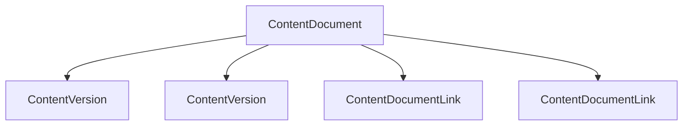

# Introduction

Salesforce Files store documents, images, and other binaries together with version and record-association metadata. Three standard Salesforce objects are central to this workflow:

- `ContentDocument` is the logical file record and points to its latest published version.
- `ContentVersion` represents one version. Its `VersionData` field contains the binary content.
- `ContentDocumentLink` connects a file to a user, group, record, library, or other supported entity and carries sharing and visibility values.

`ContentDocument` represents the logical file, `ContentVersion` stores each version and its binary metadata, and `ContentDocumentLink` associates the file with Salesforce records, users, groups, or libraries.

## Enterprise Migration Challenges

Files may need to move during org consolidation, divestiture, sandbox preparation, platform migration, archival, backup, or disaster-recovery work. Common challenges include:

- **Millions of binary files:** transfer time, disk use, and individual failures accumulate at scale.
- **API limits:** metadata queries consume finite Salesforce API capacity.
- **Session management:** tokens expire and browser downloads require an authenticated session.
- **Metadata relationships:** every relevant link must remain associated with the correct file.
- **Download validation:** a successful request does not prove that the complete file reached disk.
- **Parallel execution:** workers need isolated browsers, directories, logs, and workbooks.
- **Migration reporting:** operators need successful file paths and precise failed-ID lists.
- **Enterprise-scale reliability:** network errors, file locks, partial downloads, and reruns need predictable handling.

## Why this project exists

The downloader accepts Excel lists of `ContentDocumentId` values, validates and deduplicates them, retrieves metadata in SOQL batches, and downloads the latest file through Salesforce's authenticated Shepherd download flow. It waits for temporary files to disappear, checks stability and `ContentSize`, moves the result into an ID-specific folder, and records failures for rerun.

Optional workbooks provide local paths for inserting `ContentVersion` records and retain source `ContentDocumentLink` relationships for later destination-ID mapping. Pabot can distribute independent input batches across processes.

The tool does not import files into a destination Salesforce org, renew expired authentication during execution, or resume partially downloaded files.

---

[Next →](Installation.md)

[Back to README](../README.md)
