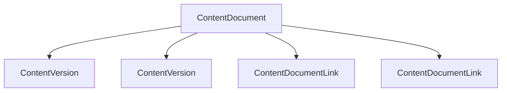

# Introduction

Salesforce Files keeps documents, images, and other binaries alongside their version history and record links. This project works with three standard objects:

- `ContentDocument` is the logical file record and points to its latest published version.
- `ContentVersion` represents one version. Its `VersionData` field contains the binary content.
- `ContentDocumentLink` connects a file to a user, group, record, library, or other supported entity and carries sharing and visibility values.

```mermaid
flowchart TD
    CD[ContentDocument]
    CV1[ContentVersion]
    CV2[ContentVersion]
    CDL1[ContentDocumentLink]
    CDL2[ContentDocumentLink]

    CD --> CV1
    CD --> CV2
    CD --> CDL1
    CD --> CDL2
```

## Migration challenges

Whether the job is an org consolidation, a divestiture, a sandbox refresh, or a backup, moving files presents the same practical problems:

- **Millions of binary files:** transfer time, disk use, and individual failures accumulate at scale.
- **API limits:** metadata queries consume finite Salesforce API capacity.
- **Session management:** tokens expire and browser downloads require an authenticated session.
- **Metadata relationships:** every relevant link must remain associated with the correct file.
- **Download validation:** a successful request does not prove that the complete file reached disk.
- **Parallel execution:** workers need isolated browsers, directories, logs, and workbooks.
- **Migration reporting:** operators need successful file paths and precise failed-ID lists.
- **Operational reliability:** network errors, file locks, partial downloads, and reruns need predictable handling.

## Why this project exists

The downloader reads `ContentDocumentId` values from Excel, converts valid 15-character IDs to their canonical 18-character form, and removes duplicates before querying Salesforce. This keeps two versions of the same ID from triggering two downloads.

Metadata is retrieved in SOQL batches, including any additional pages returned through `nextRecordsUrl`. Each unique file is then downloaded through an authenticated Shepherd request. Before reporting success, the tool checks the file against `ContentSize`, moves it into an ID-specific folder, and commits the requested migration rows. If the workbook update fails, it removes the moved file so the outputs remain consistent.

Temporary download failures can be retried a limited number of times. Invalid IDs and records without the required metadata are reported immediately. The failure workbook contains only the IDs that still need attention.

Optional workbooks provide local paths for inserting `ContentVersion` records and retain source `ContentDocumentLink` relationships for later destination-ID mapping. Pabot can distribute independent input batches across processes.

The tool does not import files into a destination Salesforce org, renew expired authentication during execution, or resume partially downloaded files.

---

[Next →](Installation.md)

[Back to README](../README.md)
