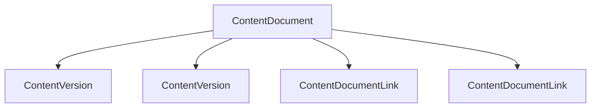

# Introduction

Salesforce Files store documents, images, and other binaries together with version and record-association metadata. Three standard Salesforce objects are central to this workflow:

- `ContentDocument` is the logical file record and points to its latest published version.
- `ContentVersion` represents one version. Its `VersionData` field contains the binary content.
- `ContentDocumentLink` connects a file to a user, group, record, library, or other supported entity and carries sharing and visibility values.

```mermaid
flowchart TD
    CD[ContentDocument]
    CV1[ContentVersion]
    CV2[ContentVersion]
    CDL1[ContentDocumentLink]
    CDL2[ContentDocumentLink]

    CD --> CV1
    CD --> CV2
    CD --> CDL1
    CD --> CDL2
```

## Migration challenges

Org consolidation, divestiture, sandbox preparation, platform migration, archival, backup, and disaster recovery all require moving files. The same problems recur:

- **Millions of binary files:** transfer time, disk use, and individual failures accumulate at scale.
- **API limits:** metadata queries consume finite Salesforce API capacity.
- **Session management:** tokens expire and browser downloads require an authenticated session.
- **Metadata relationships:** every relevant link must remain associated with the correct file.
- **Download validation:** a successful request does not prove that the complete file reached disk.
- **Parallel execution:** workers need isolated browsers, directories, logs, and workbooks.
- **Migration reporting:** operators need successful file paths and precise failed-ID lists.
- **Operational reliability:** network errors, file locks, partial downloads, and reruns need predictable handling.

## Why this project exists

The downloader reads `ContentDocumentId` values from Excel, converts valid 15-character IDs to canonical 18-character IDs, and removes duplicates before querying Salesforce. This prevents the two forms of one record from triggering two downloads.

Metadata is retrieved in SOQL batches, following `nextRecordsUrl` when Salesforce paginates a response. Each unique file is downloaded through the authenticated Shepherd flow. The downloader waits for temporary files to disappear, checks stability and `ContentSize`, moves the binary into an ID-specific folder, and commits the requested migration rows as one transaction. If the transaction fails, it removes the moved binary so the filesystem and workbooks stay consistent.

Eligible failures receive bounded, full-file retry attempts. Invalid IDs and records without required metadata are reported immediately rather than retried, and only unresolved IDs are written to the failure workbook for a later run.

Optional workbooks provide local paths for inserting `ContentVersion` records and retain source `ContentDocumentLink` relationships for later destination-ID mapping. Pabot can distribute independent input batches across processes.

The tool does not import files into a destination Salesforce org, renew expired authentication during execution, or resume partially downloaded files.

---

[Next →](Installation.md)

[Back to README](../README.md)
