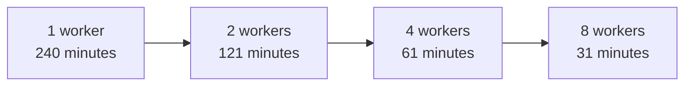

# Performance

## Benchmark results

The verified project benchmark used 10,000 Salesforce files totaling approximately 6.4 GB across 18 file types on a single machine.

| Workers | Runtime     | Speedup | Efficiency |
|---------|-------------|---------|------------|
| 1       | 240 minutes | 1.00×   | 100.00%    |
| 2       | 121 minutes | 1.98×   | 99.17%     |
| 4       | 61 minutes  | 3.93×   | 98.36%     |
| 8       | 31 minutes  | 7.74×   | 96.75%     |



These measurements describe one run configuration, not a throughput guarantee. Results vary with Salesforce response time, network conditions, file-size distribution, CPU, memory, browser behavior, disk performance, permissions, and org configuration.

## Parallel execution

Pabot splits batch tests across processes only when `--testlevelsplit` is used. Every process owns a Chrome instance and UUID-based download and artifact directories.

```bash
pabot --pabotlib --testlevelsplit --processes 4 --outputdir results src/robot/orchestrator/download.robot
```

## Worker scaling

Start with a small worker count and observe CPU, memory, disk latency, network use, Salesforce behavior, and failure rate. Increase `--processes` gradually. Similarly sized input workbooks use workers more evenly; startup and result merging can make parallel execution slower for small inputs.

## Download validation

A download succeeds only after the framework detects a non-temporary file, observes completion and stable size, verifies the size against `ContentSize`, moves the file, and verifies the destination. These checks add filesystem overhead but prevent incomplete transfers from being reported as successful.

## Retry behavior

File movement retries temporary locks until `${FILE_MOVE_TIMEOUT}` expires, waiting `${FILE_MOVE_RETRY_INTERVAL}` between attempts. Appearance, completion, and stability use separate bounds. Failed downloads are not retried indefinitely.

## Recovery and failure reporting

Failures are deduplicated into a batch-specific Excel workbook. After correcting access, session, capacity, or network problems, use those IDs in a new run. Successful outputs remain in their isolated directories. Partial binary transfer does not resume at the previous byte offset.

## Benchmark limitations

The benchmark does not isolate Salesforce-side caching, network variability, individual file sizes, workstation specifications, or org-specific limits. Use it to understand observed scaling for the stated dataset, not to predict another environment. Test representative batches before selecting a production worker count.

---

[← Previous](Architecture.md) | [Next →](Keyword-Documentation.md)

[Back to README](../README.md)
