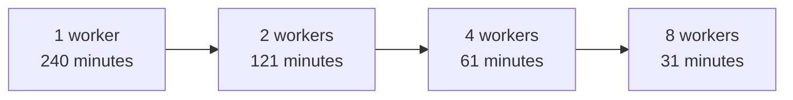

# Performance

## Benchmark results

This benchmark used 10,000 Salesforce files totaling about 6.4 GB across 18 file types on one machine.

| Workers | Runtime     | Speedup | Efficiency |
|---------|-------------|---------|------------|
| 1       | 240 minutes | 1.00×   | 100.00%    |
| 2       | 121 minutes | 1.98×   | 99.17%     |
| 4       | 61 minutes  | 3.93×   | 98.36%     |
| 8       | 31 minutes  | 7.74×   | 96.75%     |


### Runtime scaling


```mermaid
flowchart LR
    W1["1 worker<br/>240 minutes"] --> W2["2 workers<br/>121 minutes"]
    W2 --> W4["4 workers<br/>61 minutes"]
    W4 --> W8["8 workers<br/>31 minutes"]
```

These results describe one run configuration, not guaranteed throughput. Salesforce response time, network conditions, file-size distribution, CPU, memory, browser behavior, disk performance, permissions, and org configuration all affect runtime.

## Parallel execution

Pabot splits batch tests across processes only when `--testlevelsplit` is used. Every process owns a Chrome instance and UUID-based download and artifact directories.

```bash
pabot --testlevelsplit --processes 4 --outputdir results src/robot/orchestrators/download.robot
```

## Worker scaling

Start with a few workers and watch CPU, memory, disk latency, network use, Salesforce behavior, and failure rate. Increase `--processes` gradually. Similar-sized input workbooks usually keep workers busier. For very small workloads, startup and result-merging overhead can erase the benefit of parallel execution.

## Download validation

A download succeeds only after the framework detects a non-temporary file, observes completion and stable size, verifies the size against `ContentSize`, moves the file, verifies the destination, and commits the requested migration rows. These checks add filesystem and workbook overhead, but they prevent incomplete transfers or half-recorded migration output from being reported as successful.

## Retry behavior

The downloader has two retry layers:

- File movement retries temporary filesystem locks until `${FILE_MOVE_TIMEOUT}` expires, waiting `${FILE_MOVE_RETRY_INTERVAL}` between attempts.
- After the primary batch pass, failed downloads receive up to `${FAILED_ID_RETRY_COUNT}` additional full-download attempts when `${ENABLE_FAILED_ID_RETRY}` is enabled. `${FAILED_ID_RETRY_DELAY}` is applied between those additional attempts.

Appearance, completion, and file stability still use their own bounds on every attempt. Automatic retries increase total runtime when Salesforce, the browser, the network, or local storage is unreliable, so include that extra time when estimating a large migration.

## Recovery and failure reporting

Only unresolved failures are deduplicated into the batch-specific Excel workbook. IDs recovered by automatic retry are counted as successful and are not included in that workbook. If a migration-workbook transaction fails after a binary move, the binary is removed before the ID is reported as failed. After resolving permission, authentication, capacity, workbook, or network issues, use the remaining IDs in a new run. Successful outputs remain in their isolated directories. Partial binary transfer does not resume at the previous byte offset.

## Benchmark limitations

The benchmark does not isolate Salesforce caching, network variability, individual file sizes, workstation specifications, or org-specific limits. It shows scaling for this dataset only. Test representative batches before choosing a production worker count.

---

[← Previous](Architecture.md) | [Next →](Keyword-Documentation.md)

[Back to README](../README.md)
