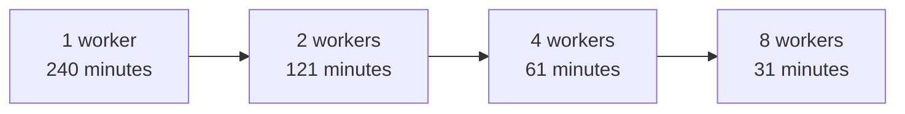

# Performance

## Benchmark results

This benchmark used 10,000 Salesforce files totaling about 6.4 GB across 18 file types on one machine.

| Workers | Runtime     | Speedup | Efficiency |
|---------|-------------|---------|------------|
| 1       | 240 minutes | 1.00×   | 100.00%    |
| 2       | 121 minutes | 1.98×   | 99.17%     |
| 4       | 61 minutes  | 3.93×   | 98.36%     |
| 8       | 31 minutes  | 7.74×   | 96.75%     |


### Runtime scaling


```mermaid
flowchart LR
    W1["1 worker<br/>240 minutes"] --> W2["2 workers<br/>121 minutes"]
    W2 --> W4["4 workers<br/>61 minutes"]
    W4 --> W8["8 workers<br/>31 minutes"]
```

These figures describe one test run, not guaranteed throughput. Results will vary with Salesforce response times, network and disk performance, file sizes, browser behavior, hardware, permissions, and org configuration.

## Parallel execution

Pabot splits batch tests across processes only when `--testlevelsplit` is used. Every process owns a Chrome instance and UUID-based download and artifact directories.

```bash
pabot --testlevelsplit --processes 4 --outputdir results src/robot/orchestrators/download.robot
```

## Worker scaling

Start with a few workers, watch the system and Salesforce response times, and increase `--processes` gradually. Workbooks of similar size help distribute the load. For small jobs, browser startup and result-merging overhead may make parallel execution slower rather than faster.

## Download validation

Validation adds some filesystem and workbook overhead. That cost is deliberate: an incomplete transfer or partially updated workbook must not be reported as a success. See [Architecture](Architecture.md#design-principles) for the checks applied to each file.

## Retry behavior

The downloader has two retry layers:

- File movement retries temporary filesystem locks until `${FILE_MOVE_TIMEOUT}` expires, waiting `${FILE_MOVE_RETRY_INTERVAL}` between attempts.
- After the primary batch pass, failed downloads receive up to `${FAILED_ID_RETRY_COUNT}` additional full-download attempts when `${ENABLE_FAILED_ID_RETRY}` is enabled. `${FAILED_ID_RETRY_DELAY}` is applied between those additional attempts.

Appearance, completion, and file stability still use their own bounds on every attempt. Automatic retries increase total runtime when Salesforce, the browser, the network, or local storage is unreliable, so include that extra time when estimating a large migration.

## Recovery and failure reporting

The batch failure workbook contains only unresolved IDs; successful retries are excluded. After fixing the relevant permission, authentication, capacity, workbook, or network problem, use those IDs in a new run. Existing successful output remains in its isolated directory, but partial downloads always restart from the beginning.

## Benchmark limitations

The benchmark does not isolate Salesforce caching, network variability, individual file sizes, workstation specifications, or org-specific limits. It shows scaling for this dataset only. Test representative batches before choosing a production worker count.

---

[← Previous](Architecture.md) | [Next →](Keyword-Documentation.md)

[Back to README](../README.md)
