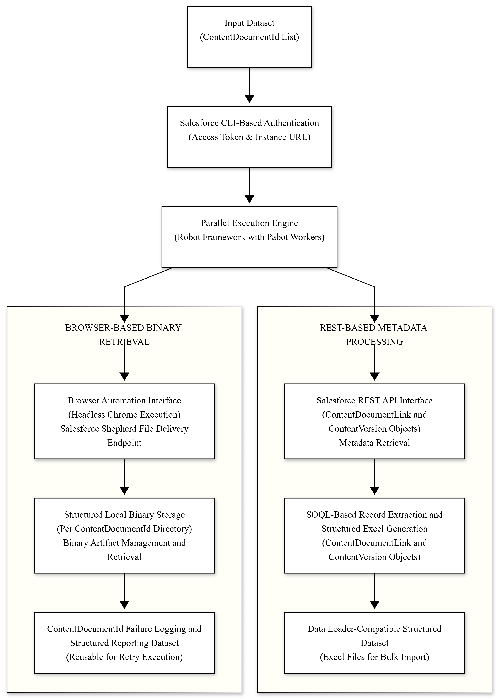

# Architecture

## Overview

The **Salesforce Files Bulk Downloader** is a Robot Framework–based automation solution designed to reliably download large volumes of Salesforce files using ContentDocument IDs. The architecture cleanly separates **source code**, **inputs**, **runtime artifacts**, and **documentation**, making the project easy to maintain, scale, and execute in parallel.

The solution combines:
* Salesforce REST APIs for metadata and validation
* Headless browser automation for secure file downloads
* Parallel execution using pabot
* Deterministic folder isolation to avoid file collisions
* Dynamic Excel generation for ContentVersion and ContentDocumentLink records

---

## High-Level Architecture

<p align="center">
  
</p>

## Repository Structure

```
salesforce-files-downloader-tool/
├── .github/
│   ├── workflows/
│   │   └── robot-tests.yml                                # GitHub Actions CI
│   └── PULL_REQUEST_TEMPLATE.md                           # Pull request template
├── ci/
│   └── robot/
│       └── Smoke.robot
├── docs/
│   └── architecture.md                                    # High-level design documentation
├── downloads/                                             # Runtime: downloaded Salesforce files
│   └── <test_name>_<uuid>/                                # One folder per pabot process
│       ├── 069xxxxxxxxxxxx/                               # ContentDocumentId folder
│       │   └── <original_filename>
│       └── 069yyyyyyyyyyyy/                               # ContentDocumentId folder
│           └── <original_filename>
├── input/                                                 # Input Excel files
│   ├── Inputfile_1.xlsx
│   └── Inputfile_2.xlsx
├── output/                                                # Runtime: Failed records + Data Loader-ready Excels
│   └── <test_name>__<uuid>/                               # One folder per test case
│       ├── <test_name>_Failed_IDs_List.xlsx
│       ├── <test_name>_ContentVersion_Inputfile.xlsx
│       └── <test_name>_ContentDocumentLink_Inputfile.xlsx
├── results/                                               # Robot execution results
│   ├── pabot_results/
│   ├── log.html
│   ├── output.xml
│   └── report.html
├── src/
│   └── robot/
│       ├── library/
│       │   ├── ExcelLibrary.py
│       │   ├── SalesforceSupport.py
│       │   └── WebdriverManager.py
│       └── tests/
│           ├── Support.robot
│           └── Test.robot
├── .gitignore
├── .pabotsuitenames                                       # Pabot suite cache file
├── CODE_OF_CONDUCT.md
├── CONTRIBUTING.md
├── README.md
├── requirements.txt
└── SECURITY.md

```

## Folder Responsibilities

* **docs/**       – Architecture, design decisions, and technical documentation
* **src/robot/**  – Core Robot Framework test suites & support keywords (Robot + Python)
* **input/**      – Excel files containing ContentDocument IDs
* **downloads/**  – Runtime download workspace (isolated per pabot process)
* **output/**     – Failed records, validation warnings, generated Excel files to upload to data loader
* **results/**    – Robot Framework execution artifacts including pabot results

---

## Execution Model

### Authentication

* Salesforce authentication is handled externally via Salesforce CLI
* `sf org display --json` generates `org_info.json`
* Access token–based authentication avoids username/password usage

### Parallel Execution

* pabot splits execution across multiple processes
* Each process creates a unique `<test_name>_<uuid>` download directory
* Browser instances and file operations are fully isolated
* Separate `output/` folder per test case for traceability


### Download Flow

* Read ContentDocument IDs from Excel
* Initialize Salesforce REST session
* Query metadata using SOQL (ContentDocument & ContentDocumentLink)
* Launch headless Chrome with a custom download directory
* Download files using Shepherd endpoints
* Validate file completion and size 
* Move files into ContentDocument-specific folders 
* Generate Excel files for ContentVersion and ContentDocumentLink 
* Log failures and create separate failed IDs Excel 
* Clean temporary artifacts

---

## Failure and Recovery Model

* Failed downloads are logged per test case
* Partial files are cleaned automatically
* Execution can be safely resumed by rerunning failed batches
* Output Excel files preserve successful records

---
## Security Architecture

* Authentication delegated to Salesforce CLI
* No credentials stored in source code
* Access tokens loaded at runtime
* Auth files excluded via .gitignore
* CI runs without org credentials

---
## Runtime vs Source Separation

| Category            | Location     | Notes                        |
|---------------------| ------------ | ---------------------------- |
| Source code         | `src/robot/` | Version-controlled           |
| Input data          | `input/`     | Replaceable, non-runtime     |
| Downloads           | `downloads/` | Runtime only, ignored by git |
| Failed logs & Excel | `output/`    | Runtime artifacts            |
| Reports             | `results/`   | Robot Framework outputs      |
| Docs                | `docs/`      | Architecture & design        |

---

## Design Principles

* Deterministic folder isolation per process/test case
* Idempotent execution (safe to rerun)
* No credential hardcoding
* Clear separation of concerns
* Scalable to very large datasets (thousands to millions of files)
* CI/CD and headless execution ready
* Automatic Excel generation for traceability & re-use

---

## Scalability Considerations

* Parallel execution with pabot
* Stateless browser sessions
* UUID + test-name-based directory isolation
* Streaming downloads instead of in-memory storage
* Safe cleanup of partial and corrupted files
* Separate output per test case avoids collisions

---
## Extensibility

The framework supports extension via:

* Additional Robot keywords
* New Python helper libraries
* Alternative storage backends
* Custom validation rules

---
## Observability and Monitoring

* Execution status available via Robot HTML reports
* Per-process logs under `results/pabot_results/`
* Failed records isolated in output Excel files
* Timestamped execution artifacts enable auditing

---
## Deployment Model

* Local developer machines
* CI/CD pipelines (GitHub Actions, Jenkins)
* Headless server environments
* Containerized environments (planned)

---

**Author:** Bhimeswara Vamsi Punnam

**Role:** Lead Software Development Engineer in Test (SDET)
